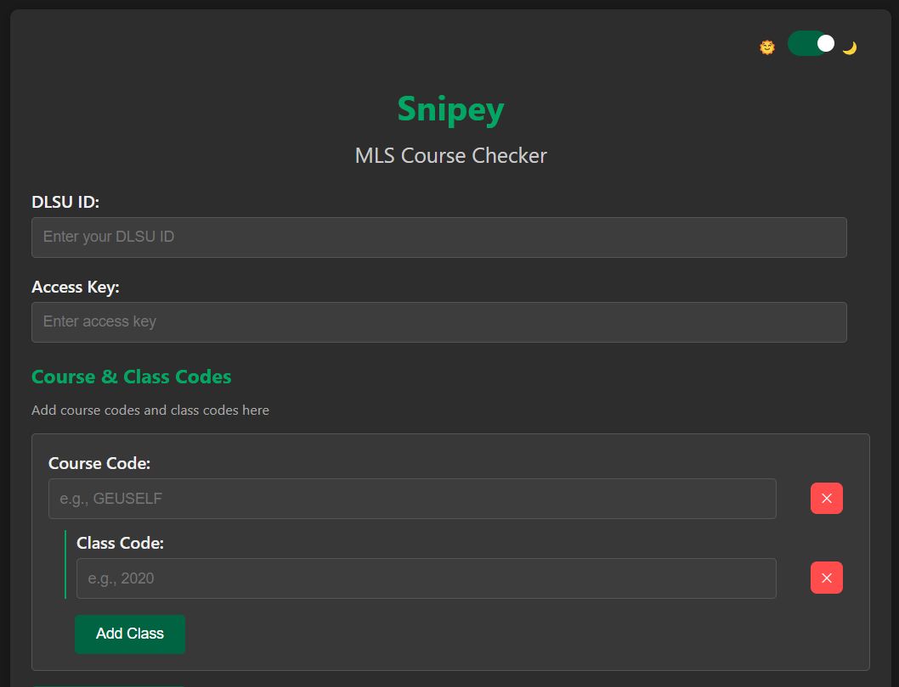
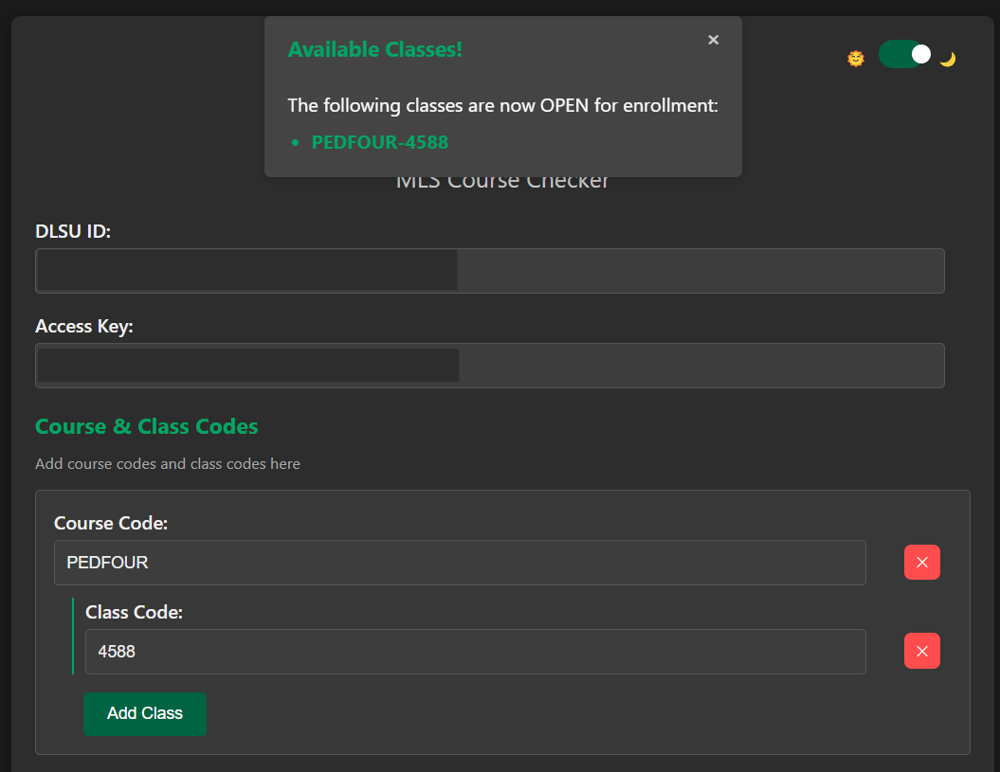
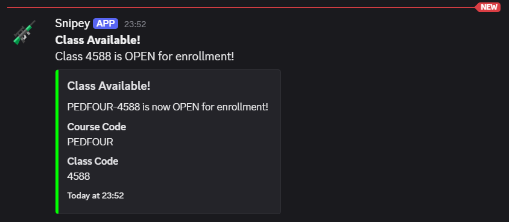

---
Snipey
<p float="left">
  
  
  
</p>
---
## Setup

### 1. Clone the repository
```bash
git clone https://github.com/daniellalimbag/snipey.git
cd snipey
```

### 2. Install dependencies
```bash
npm install
```

### 3. Start the app
```bash
npm start
```

Checks and sends notifications on the app and discord if a course is available.
An access key from me is needed to use the app.

---
## Tech Used
- **Electron**
- **Node.js**
- **SeleniumBase**
---
